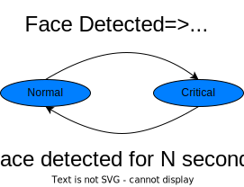

<!--
SPDX-FileCopyrightText: 2022 Intel

SPDX-License-Identifier: Apache-2.0

-->

# Application Function

This repository implements a 5G Application Function (AF) that interacts with sample face detection application running as client/server mode over 5G networks and dynamically provisioning the underlying 5G network QoS by calling the 5G Network Exposure Function (NEF) AsSessionWithQoS API. The [face detection](https://github.com/joshuazhu78/dlstreamer/tree/devQoS/samples/gstreamer/gst_launch/face_detection_and_classification) application is implemented using Intel® Deep Learning Streamer (Intel® DL Streamer). Below figures illustrates the overall architecture:


## 5G

This AF has to be tested with 5G end to end system with NEF to open network API for the applications. For 5G, [Aether](https://docs.aetherproject.org/master/index.html) can be used, which contains a light weight 5G core networks and a ROC based management plane. Real gNB or gNB emulator can be used to create an end to end system for testing the applications. For testing with a gNB and UE emulator, [UERANSIM](https://github.com/aligungr/UERANSIM) can be used. After you successfully setup a 5G network with UE attached to it and got an IP address allocated, you are ready to run the face detection application over the 5G networks.

## Running the application

The face detection application needs to be run in client/server mode. With client running at the UE and lively streaming a web camera video over the 5G network using real time RTP protocol. Suppose the server is running at the DN on IP 192.168.250.1 and UE gets IP allocated as 172.250.0.1 by the 5G networks. Firstly configure the route table at UE to ensure the traffic towards DN going through the 5G networks.

Route configuration at the client/UE side:
```
$ sudo ip route replace 192.168.250.0/24 via 172.250.0.1
```

Then running the face detection server at DN:
```
$ ./face_detection_and_classification.sh port=9001 CPU display-and-json fifo nofps
```

Lastly run the client to stream the video from the USB camera to the DN:
```
$ ./face_detection_and_classification.sh /dev/video0 CPU "host=192.168.250.1 port=9001"
```

### Run the AF at the server

After the face detection application is run successfully on the 5G networks, AF can be run:

```
$ go run af.go
```

AF function usage is as below:

```
Usage of af:
  -fifoFile string
        fifo filename (default "/tmp/output.json")
  -inactiveTimer uint
        Inactive length before firing NEF delete (default 10)
  -nefJson string
        NEF post json for QoS provisioning
  -nefSvcEndpoint string
        NEF service endpoint
```

The AF logic is described as two states machine:



## Sample output

Below video shows a demo of dynamic provisioned 5G QoS driven by face detection.

[](http://weip-bj.bj.intel.com/facedetection-af.mp4)

